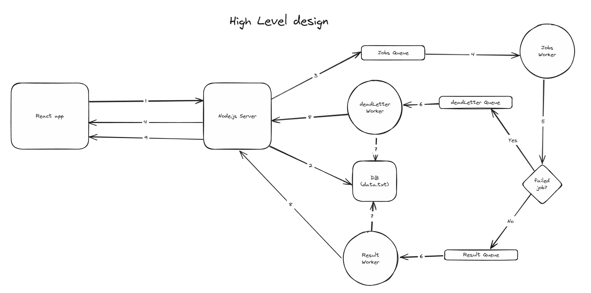

# Calo Task

## High Level Design
<strong>Flow: Job creation, processing and real-time update back to Client</strong>


1. Client sends request to create job `POST /jobs`
2. Server generates a id and stores the job in pending state in DB
3. Adds job to a message queue (Jobs Queue)
4. Returns response to FE with Job id and pending status
5. Jobs worker processes job
6. If it succeeds, it adds the result to results queue, else if it fails, it adds it to the dead letter queue
7. If it <br />
    a. succeeds, Results worker picks it up <br />
    b. fails, Dead letter worker picks it up
8. If it <br />
    a. succeeds, Results Worker updates the result in DB <br />
    b. fails, Dead letter worker updates job status and error info in DB
9. If it <br />
    a. succeeds, Results worker publishes the result to the app server which subscribes to it <br />
    b. fails, Dead letter worker would publish the result to the app server which subscribes to it
10. App server then relays the result and status to the server as soon as it recieves it through server side events which would be a better choice over websockets in this case where there's unstable internet connection issue b/w client and server. 

Note: In code, step 9 is not handled as written here. I've mentioned the reason in backend/src/index.js

<strong> Wondering why we are using results & dead letter queues/worker instead of only jobs queue/worker? </strong>

It is to allow job worker to process jobs with more efficiently and let's say if a job is processed, but the job worker crashes. In this case, if had logic to update the result in DB inside the jobs worker then we would lose it the result. Also, incase database is not available then also the result gets lost. Results queue/worker makes sure it retains the result and retries on failure while taking the responsibility to update result in database. Similarly, dead letter queue or worker can be used to manage failed jobs i.e write them in a separate database and retry through a scheduled cron job later depending on the requirements how we want to handle failed jobs.

## Setup Instructions

Clone this git repository on your machine
```
git clone https://github.com/usman64/calo-task.git
```

### Frontend: React App
Open a terminal and inside the `frontend` directory run 
```
npm i
npm run dev
```
You should be able to access the app on `http://localhost:5173/`


### Backend: Node App
First, create a copy of `.env.sample` file and rename that file to `.env`. Update your `UNSPLASH_ACCESS_TOKEN` in the file

Then, open a terminal and inside the `backend` directory run
```
docker-compose up --build
``` 
This would run a:
1. Node app server in a docker container
2. Redis container to support `bullmq` message queues
3. Jobs worker in a docker container
4. Bind mount will be created to retain db data and let containers read/write it. You will notice a directory named `local_db_copy` appear in the project's root folder once containers are initialised successfully. This is where you can see files storing data from different environments.

Note: To run in detached mode add `-d` flag

To stop the containers, run 
```
docker-compose down
```

#### Test your app:
To run tests, with docker compose
```
docker-compose -f docker-compose.test.yml up --build
```
To run tests, locally you'll need to run a redis container locally and then run
```
npm run test
```
Note: Here I've added tests for job controller only in interest of time

## Time Report:
| Task                                                    | Time Spent |
|---------------------------------------------------------|------------|
| Project Planning                                        | 2 hours    |
| Backend   - Project Initialization                      | 1 hour     |
| Backend   - Implement Job Endpoints                     | 1 hour     |
| Backend   - Implement Job Execution Logic               | 3 hours    |
| Backend   - Implement DB layer using file-system        | 1.5 hours  |
| Backend   - Implement SSE for real-time job updates     | 2 hours    |
| Frontend  - Project initialization                      | 1 hour     |
| Frontend  - Job List Page                               | 1.5 hours  |
| Frontend  - Job Detail Page                             | 30 mins    |
| Frontend  - Job Creation Flow                           | 1 hour     |
| Frontend  - Real-time Job Updates                       | 2 hours    |
| Backend   - Containerizing app                          | 2 hours    |
| Testing and Debugging                                   | 6 hours    |
| Documentation                                           | 1 hour     |
| **Total**                                               | **25.5 hours** |

## Future Improvements:
Backend:
1. Add an API Gateway to add
    - rate limiting since unsplash API supports only 50 requests per hour in free mode
    - reverse proxy as if we would horizontally scale our app servers we'll need it
2. Add a loadbalancer to load balance if we scale up app servers
2. Manage scalability for
    - Node app server by adding it to a ASG on AWS or orchestration through K8s
    - Worker by deploying it on any serverless service i.e lamda
3. Refactor DB layer to add a managed DB i.e MongoDB/DynamoDB so that we can also run results and deadLetter worker separately on lamda as well for scalability
    - When deploying on lamda we'll need pub/sub to between worker and app server who will send server side events
4. Download images for jobs and serve them through CDN, so that we don't have to hit unsplash repeatedly for images and would reduce latency. But, CDN is expensive so alternatively you can store images in S3 and add a caching layer infront of it.

Frontend:
1. Cache images (May use browser caching or Nextjs which provides image caching out of the box)
2. Initialise both projects with a monorepo framework or orchestrator like TurboRepo to use commonly shared interfaces i.e Job interface etc. TurboRepo also provides support for remote caching which would make builds super fast.